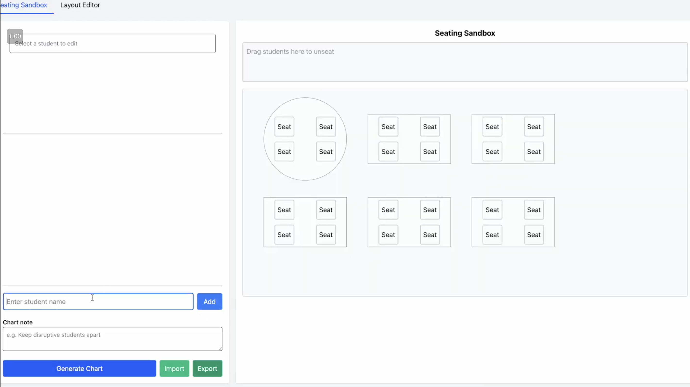

## Project Overview

This project is a web application designed to help educators easily create and manage student groups and seating for classroom activities. It allows teachers to add student profiles, input custom grouping constraints, and automatically generate balanced groups. We are also exploring integration with large language models (LLMs) to support natural language input for constraints and provide intelligent suggestions for group formation.

## smartArrange Logos

## Interaction Flow

## Running the Interaction Flow
To run the interaction flow, clone this project. Then, within the project directory, run `npm install`. Finally, run `npm run dev`. 
